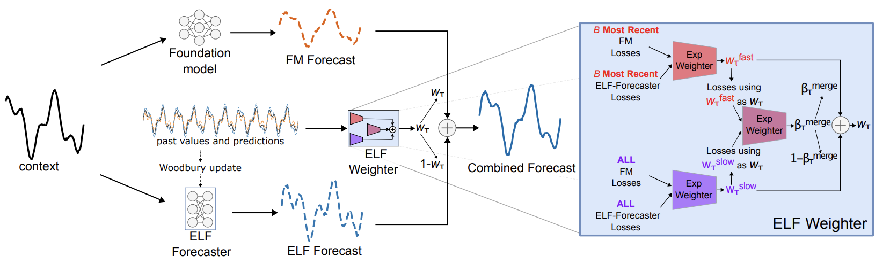

{ caption = "figure 1" }

## Basic Information

*   **Paper Title:** Lightweight Online Adaption for Time Series Foundation Model Forecasts
*   **Authors:** Thomas L. Lee, William Toner, Rajkarn Singh, Artjom Joosem, Martin Asenov
*   **Institution:** Huawei, University of Edinburgh
*   **Publication Link:** [arXiv:2502.12920v2](https://arxiv.org/abs/2502.12920)
*   **Code Link:** Not available

## One-Sentence Summary

This paper proposes a lightweight framework called **AdapTS** that dynamically combines predictions from a small model (AdapTS-Forecaster) learned online with predictions from a pre-trained, fixed foundation model (FM), enabling efficient utilization of new data to adapt to distribution changes and continuously improve time series forecasting performance after model deployment.

## Core Problem

This paper aims to solve a very practical and important problem:

...
